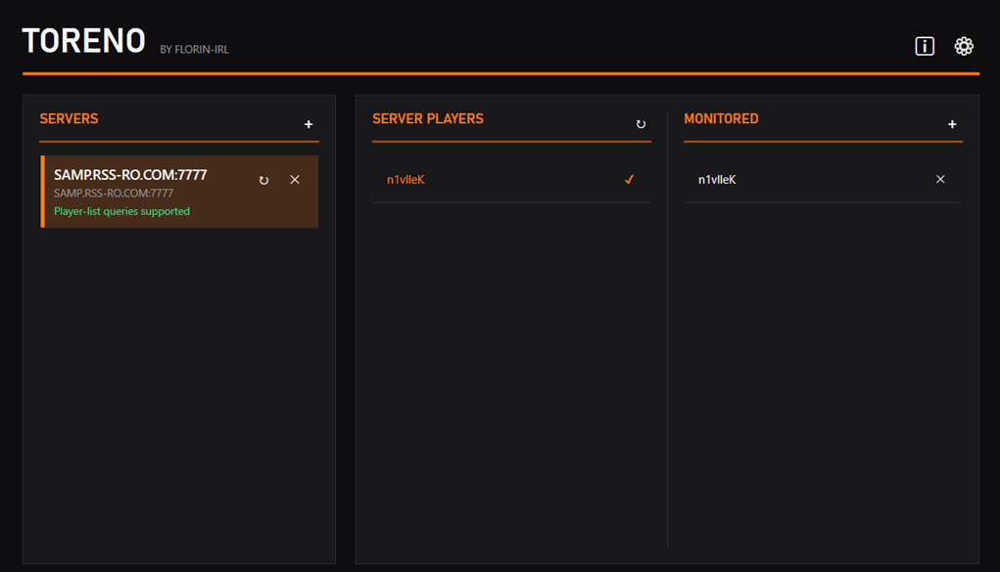

[](https://github.com/florin-irl/toreno/releases/latest)

*Somewhere, somehow, Toreno already knows you're online.*

Toreno is a Windows tray app that watches one or more SA-MP servers' player list and sends a Windows notification when a friend you're watching for connects.

> [!NOTE]
> Windows SmartScreen will likely warn that `TorenoSetup.exe` is from an "unknown publisher" the first time you run it. That's expected for an unsigned hobby project (code-signing certificates cost money), such as this one. The source is right here if you want to check for yourself. Click **"Run anyway"** to proceed.

## Usage



Install Toreno and it sits in your system tray. Double-click the icon to open the management window, press the **+** next to Servers, and give it an address (`host:port`). Toreno checks the server right away over its public UDP query protocol - the same one server browsers use, no game client or login involved - and tells you whether it can actually see individual players there (some larger servers disable that part of the protocol; see Known limitations below). Once a server's added, its live "who's online" list shows up on the right - click a name to start watching it, or add one manually if the person isn't online yet. From then on, Toreno polls that server in the background, diffs the player list against what it saw last time, and fires a native Windows toast the moment a watched name shows up - including an immediate check for anyone already online when you start watching, so you're not stuck waiting for a rejoin. Closing the window just hides it; Toreno keeps running from the tray until you choose Exit, and can optionally launch itself at Windows startup (toggle it from the cog icon).

## How the polling works

SA-MP servers speak a small, public UDP query protocol - the same one every server browser uses to show player counts and names. There's no login and no handshake, just a single request/response packet pair per query. Every packet starts with the 4 ASCII bytes `SAMP`, followed by the server's IP and port, then one opcode byte:

- Opcode `i` asks for server info - hostname, gamemode, language, current/max player count.
- Opcode `c` asks for the player list - a name and score for everyone currently connected.

Toreno sends one of these packets, waits for the UDP reply, and parses the raw bytes back into a player list. It polls each server on a fixed interval (15 seconds by default), diffs the result against what it saw last time, and only fires a notification on an actual join - or once immediately on the very first check, for anyone already online.

**Tidbit:** the protocol is oddly inconsistent about how it encodes strings. Player names in the `c` response are prefixed with a single length byte, but the `i` response prefixes its strings (hostname, gamemode, language) with a 4-byte length instead. Same protocol, two different conventions a few bytes apart - miss that and every field after it silently comes out corrupted.

## Known limitations

> [!IMPORTANT]
> Servers with a large max-slot count (roughly >100) disable the player-list query opcode entirely, as an anti-UDP-amplification measure - the server simply won't answer that part of the protocol, for anyone. Toreno can't see individual player names on those servers, and doesn't try to work around that by connecting as a fake game client, since that would mean running an unauthorized bot connection against a server's own rules. When you add a server, Toreno checks and flags whether it supports player-list queries, so you know right away whether it's watchable.

> [!CAUTION]
> Toreno is meant for one thing: getting notified when a friend joins a server you already play on together. Don't use it to track, monitor, or follow someone without their knowledge or consent - that's not what this is for.

## Building the installer

> [!NOTE]
> Requires [Inno Setup 6](https://jrsoftware.org/isinfo.php) (`winget install JRSoftware.InnoSetup`).

```powershell
installer\build.ps1
```

This publishes a self-contained single-file Release build and compiles `installer/Toreno.iss` into `installer/Output/TorenoSetup.exe` — a standalone installer with an uninstaller, Start Menu shortcut, optional desktop icon, and an optional "launch at Windows startup" task.

## Why does this exist?

For fun, and to learn about installers and Windows tray applications.

## License

MIT - see [LICENSE](LICENSE).
